# B787 flight

Here's a guide to help out with the operations for the 787-10 with AUU2.

**Note about FMS terminology**

We commonly talk about selecting or inserting value into a line on the FMS. It can be seen that there are 6 buttons on each side, to insert or copy a value. To clarify, if I "*line-select L4*", it means that I press on the 4th button on the left side on the FMS. The bottom line where we type text or values to insert is called the "*scratchpad*". See example below, not from the B787.

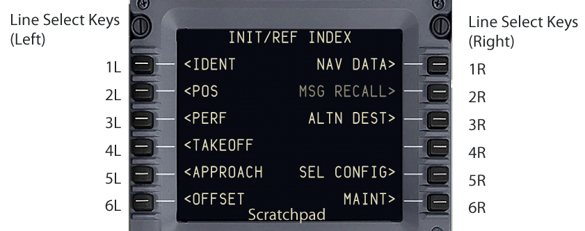


## Flight planning

As the goal is to operate the aircraft as real as it gets, I suggest setting only the departure airport with an appropriate gate/parking for the B787. Do not set the arrival airport. We will be from London Heathrow Airport (EGLL - Parking 242), to Frankfurt airport (EDDF), with Dusseldorf as an alternate (EDDL).

Our callsign will be BA732 (Speedbird 732) and the route will be:

```EGLL DET2G DET L6 DVR UL9 KONAN UL607 SPI T180 UNOKO UNOKO4A EDDF```

## Weight and balance

The fuel burn needs to take into account takeoff, climb, cruise, descent, approach, go-around, diverting to alternate, approach to the alternate, go-around and fly for another 30 minutes. As an estimation, I would suggest this equation to calculate the fuel burn, using track miles as the input variable

$$ m_{fuel} = 28000 + 2.5* d_{nm} $$

The objective is to:
- Save 6000lbs for a 30-minute reserve.
- Save 17000lbs for an alternate within an hour of flight.
- Save 5000lbs for takeoff and climb which requires more fuel in track miles.
- Fuel burn is approximately 12000 pounds an hour, with a zero-wind average of 500kts, yielding a consumption of 2.5lbs/nm.

Please provide feedback to this calculation. The objective is to give a conservative ball park as a fuel load. Don't crucify but give feedback with flight examples, it would be appreciated.

On the weight and balance page, you must set:
- Fuel quantity - 67,000lbs
- Payload - $220*nb\ of\ pax = 220*300 \approx 66,000lbs$
- Take note of the center of gravity - 20%


Close the window and click *Fly now!*

## Entering the flight deck

### Establishing electrical power with external power

- BATTERY - ON
- EXT PWR (FWD L, FWD R, AFT) - ON

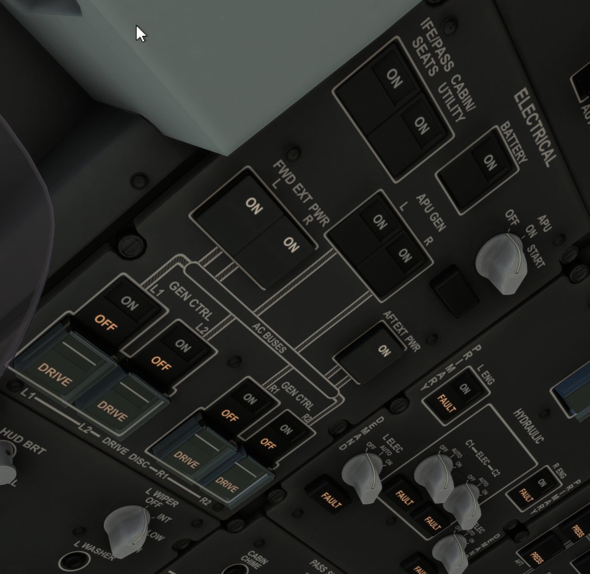

### Establishing electrical power with APU

- BATTERY - ON
- APU - START then ON

## Aligning IRS

- IRS (L & R) - ON
- SET INERTIAL POS in FMS
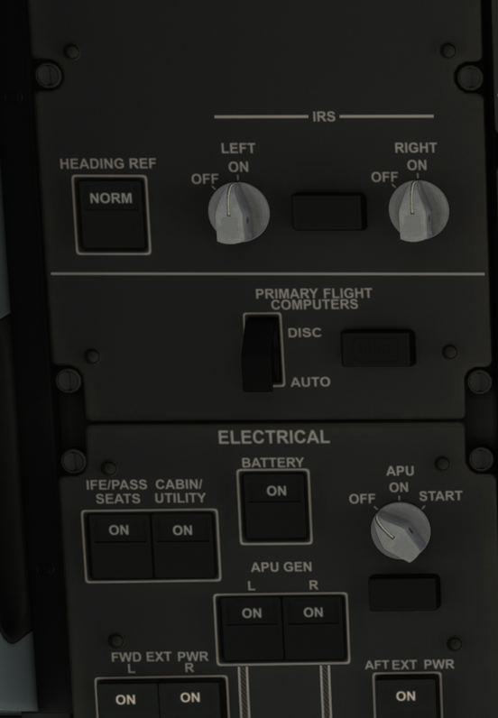

In order to set the position, navigate to POS INIT page on the FMS. If not shown, press INIT REF, IDENT, POS INIT. The easiest way is to align with GPS position. Line-select R4 to copy the GPS POS, and click on line-select R5 to set the inertial position.
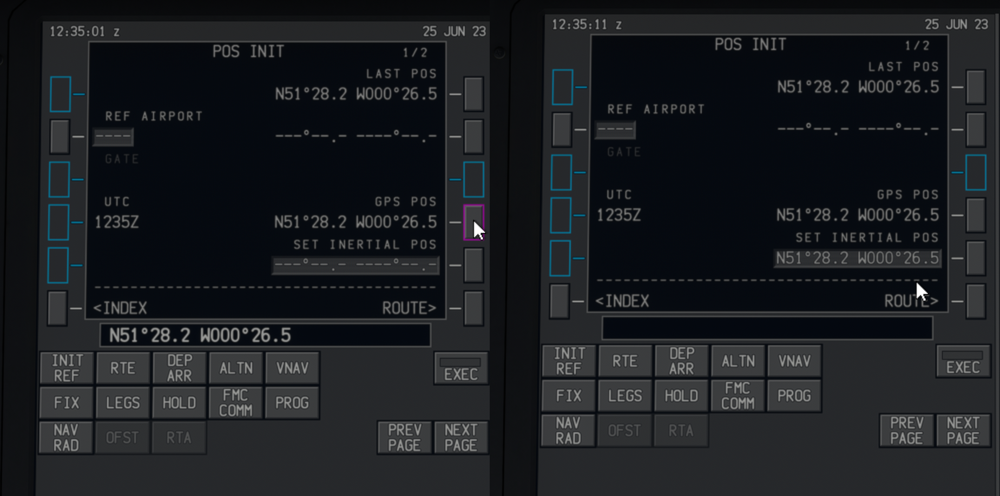

### For first time users

For first time users, I suggest clicking on INDEX, and SETTINGS. You will find the page below. In real life, we always fly with the ND UP MODE in HDG. You can set the IRS ALIGN TIME as you please, to instantaneous, accelerated (~1 min), or real alignment (~7 min).

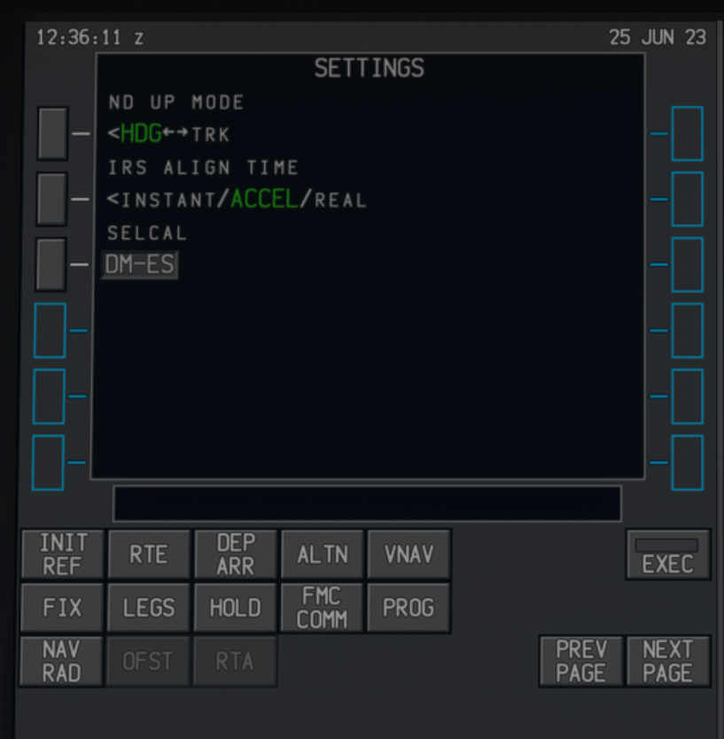


## Ramp check

Here's a description of the ramp check. It describes only the switches which are not at the proper position by default.

- IRS (2) - ON
- APU - AS REQ'D
- FD DOOR POWER - ON
- EMER LIGHTS - ARMED
- WINDOW HEAT PRIMARY L&R (4) - ON
- HYDRAULIC ELEC PUMPS (L-C1-C2-R) - ON
- PASS SIGNS - ON
- FUEL PUMPS (L-R FWD-AFT) - ON
- FUEL CENTER PUMPS (if fuel in center tanks) - ON
- WING ANTI-ICE - AUTO
- ENG ANTI-ICE - AUTO
- NAV & LOGO lights - ON
- RECIRC FANS UPPER & LOWER - ON
- PACK L & R - ON


After the ramp check, we can pick up the ATIS to copy the wind, altimeter, temperature, and runway in use for departure.

## FMS programming

The FMS programming is made the CDU (Control Display Unit). It is sequential and it's better to keep the same sequence to prevent errors. At each named page, we shall note how many pages exist (top-right corner) and we must go thru each pages to complete the preflight setup.

The IRS alignment could be initialized by one of the pilots, while the FMS programming will be done by both pilots together. As a good measure, we start at POS INIT to confirm location.

Click INIT REF to return to POS INIT page.

### POS INIT

This is a crosscheck of the position, and taking look at page 2. No actions required.

As a general rule, as all the pages have been reviewed from one section (eg. POS INIT), the next page will always show at the bottom right corner (line-select R6, except for the alternate which will be at R5). Click on ROUTE (line-select R6) on page 1.

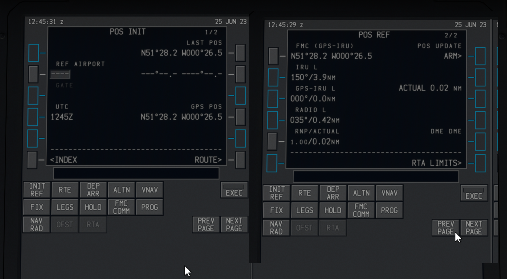

### RTE page

Fields to complete:
- ORIGIN - EGLL
- DEST - EDDF
- FLT NO - BA732
- ACTIVATE (line-select R6)
- EXEC

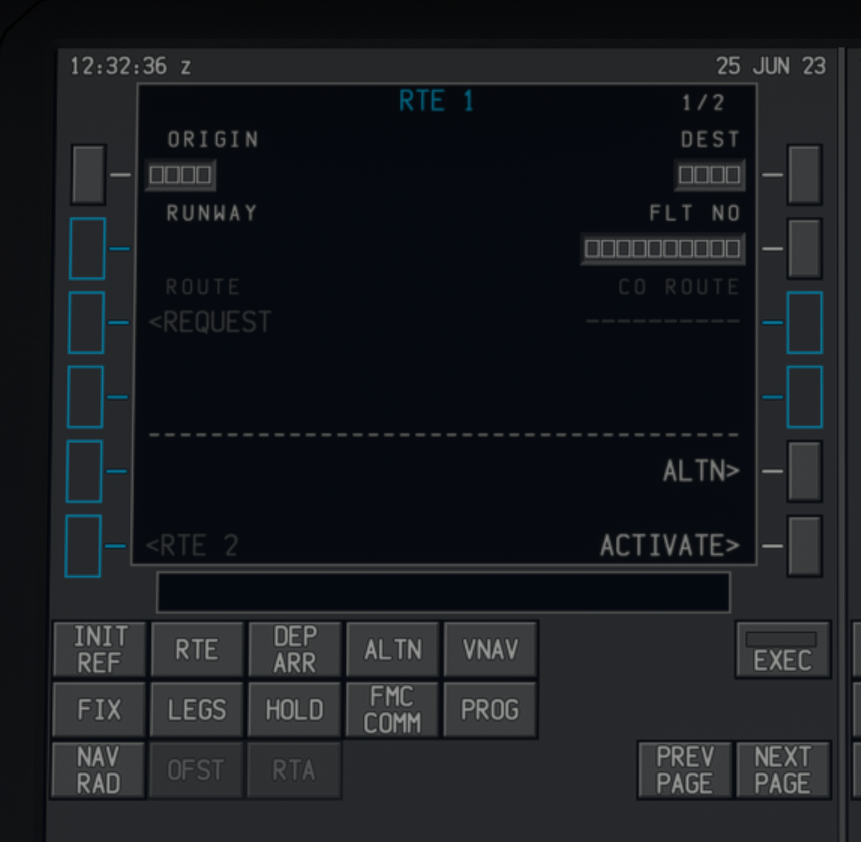

### ALTN

Press ALTN
- Type EDDL in scratchpad
- Line-select L1 to designate EDDF as alternate

The screenshot below was taken in-flight because I forgot to take it on the ground. There is a rough estimate for an ETA, fuel overhead.


If you line-select R1, more flight parameters are customizable, and also, you have a divert now, a quick way to head over to EDDF.

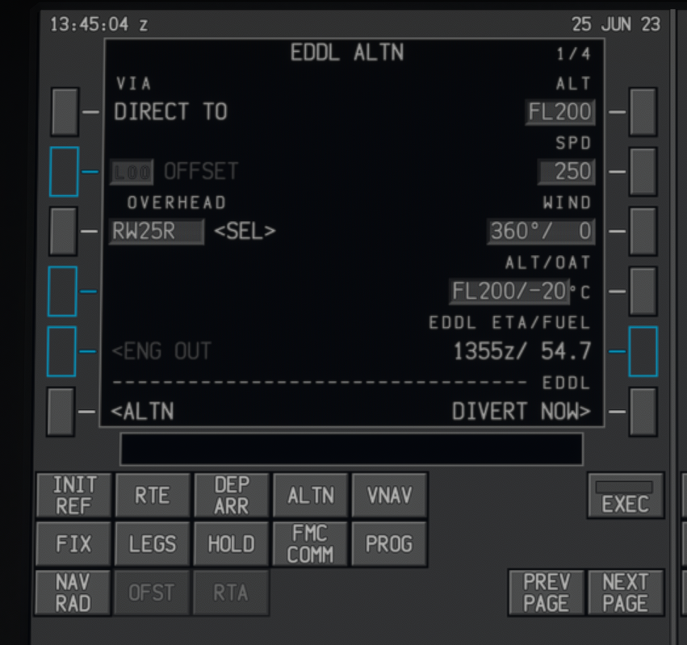

Next, we program the route starting with the SID. Click DEP/ARR.

### DEP/ARR

- Select runway 27L.
- Select ILS27L for the HUD guidance during takeoff.
- Select DET2G as the SID.
- Line-select R6 - ROUTE to get to ROUTE page 2.

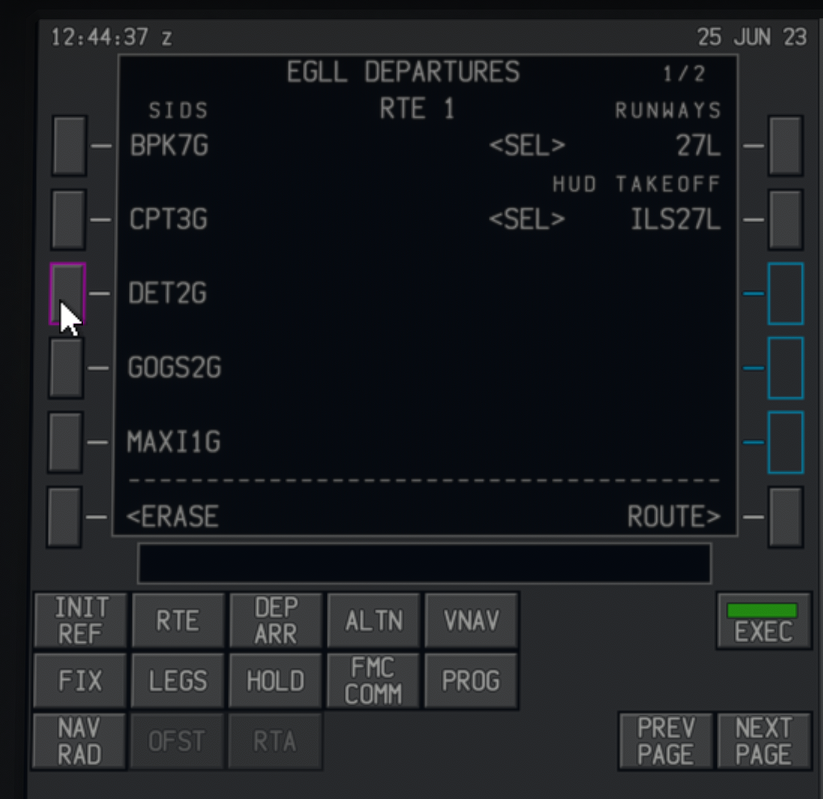

### RTE page 2

Here we enter the route. On the left, we enter airways, and on the right, we enter the fix. If it's a direct to without an airway, we only enter the fix on the right. Here's an example of entering an airway. From *DET*, we fly airway *L6* to *DVR*. So, we enter airway *L6* in the scratchpad and enter it on the left.

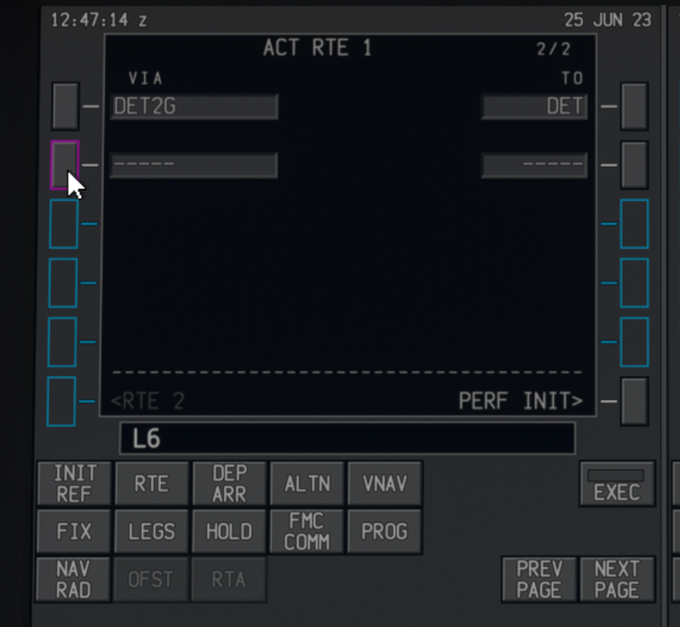

Our FMS is then showing us that it needs a value on the right with the empty boxes.

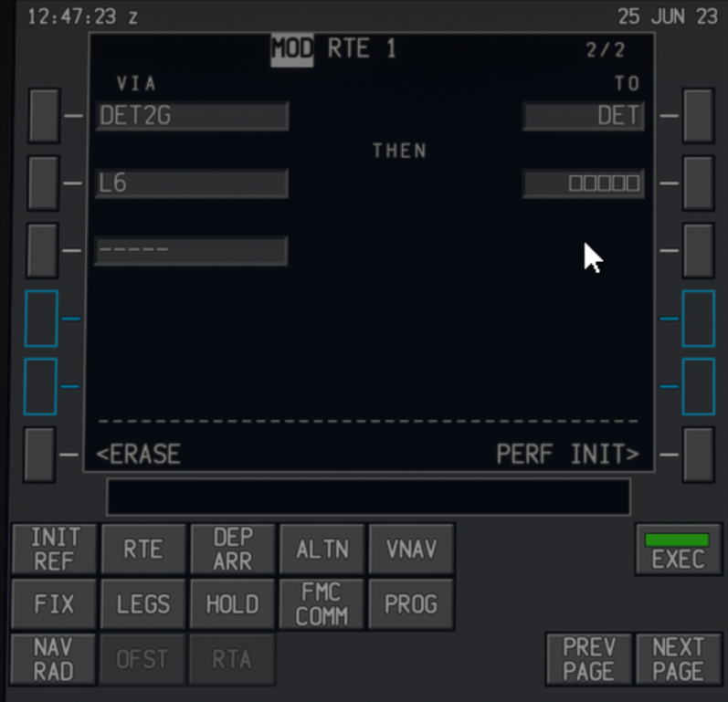

We enter *DVR* in the scratchpad and insert it at line-select R2.

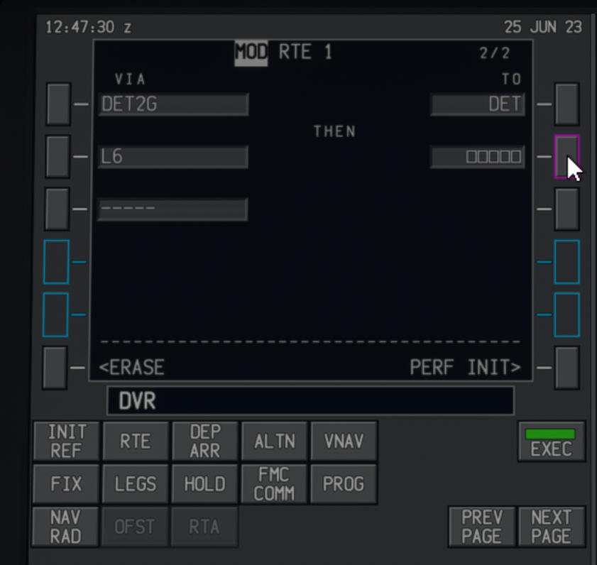

I'll leave as an exercise to complete the route. Here's a copy of it again below. Leave out UNOKO4A as it is the STAR.

```EGLL DET2G DET L6 DVR UL9 KONAN UL607 SPI T180 UNOKO UNOKO4A EDDF```

You should get the same as below.

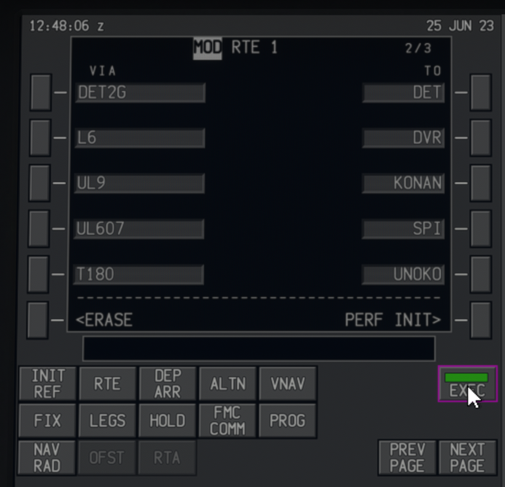

Now to insert the STAR and approach, click on DEP/ARR button.

### ARR page

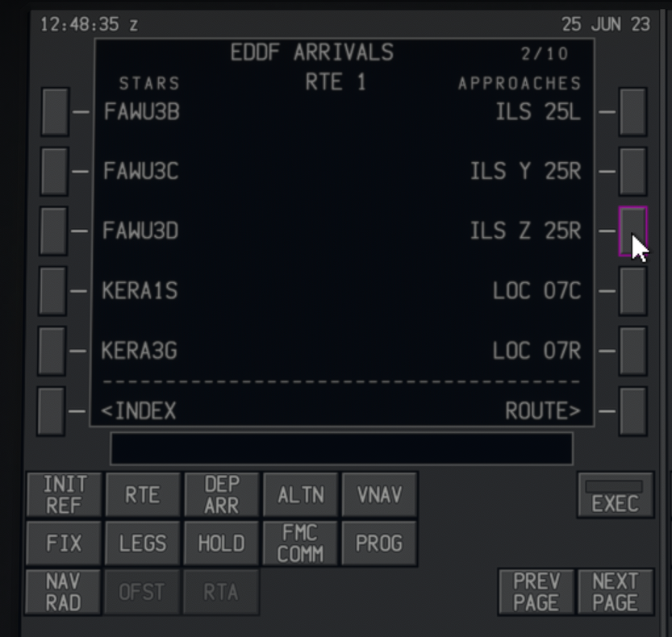

Choose
- ILS Z 25R
- UNOKO4A
- Click on ROUTE (line-select R6)
- Confirm the approach is in.
- EXECUTE

We follow the logic, and click on PERF INIT (line-select R6).

### PERF INIT

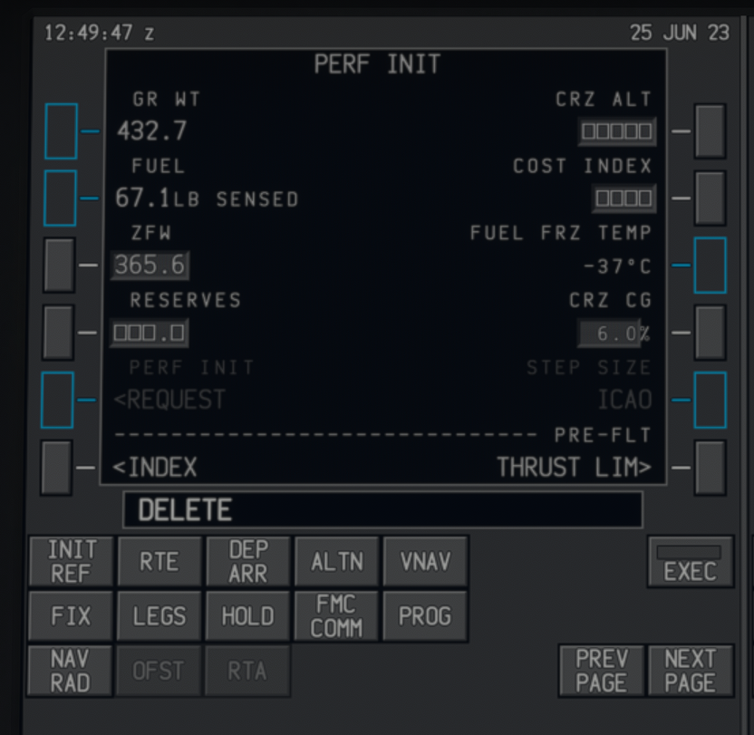


We fill in the blanks here (ZFW should be empty on the screenshot and GR WT won't be showing). ZFW can be calculated from the weight written on the EICAS minus the fuel on board. 

$$
432.7 - 67.1 = 365.6
$$

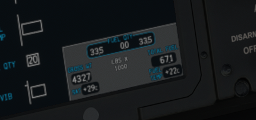

*Reserves* is the 30 minute reserve after flying to the alternate, which is about 6000 pounds. The cruising altitude for this flight will be FL350. The cost index is a reference used to determine how fast we want to go versus saving fuel. Cost index 0 is the most fuel efficient flight, a higher cost index (200) will be faster. Use 50 for this flight. Let's default CRZ CG to 28% (no observed effect so far in MSFS). Fill out the page as below.

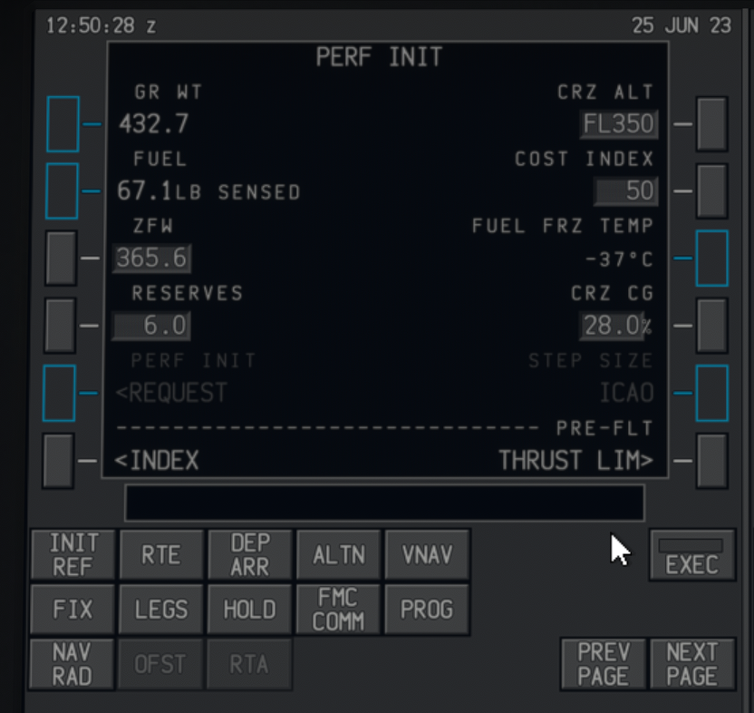

Follow the logic, still, click on THRUST LIM (line-select R6)

## THRUST LIM

Pilots rarely takeoff with full available thrust. Wear and tear on the engine, increased maintenance cost, fuel burn and the fact that most of the time we don't need the full available thrust are all reasons why we reduced the thrust used during the takeoff. That's the page to do it. Normally, we would get the data from takeoff performance calcuation. Although, we don't have the tool to assess accelerate-stop and climb performance in the event of an engine failure. It is quite an involved calculation in real life, done by computer obviously. 

At L1, we can enter a temperature. If we enter a higher temperature than the actual outside air temperature, we use the *Assumed Temperature Method* to reduced thrust. We can combine this with a further derate with TO 1 or TO 2. With my own experience, I discourage using TO 2. I typically use around an assumed temperature between 40C (heavier weights and shorter runways) and 50C (shorter flight with long runways), and TO 1. If the runway is contaminated, use the actual temperature and full rated takeoff thrust.

On the right, you can select a derated climb. I like to use CLB 2 to fly lower longer. In real life, you save on the engine cost and fuel. If it's turbulent in the low-level or with storms in the area, use full climb thrust to reach cruise altitude faster.

As shown below, for this flight

- SEL temperature - 50
- TO 1
- CLB 2


Click TAKEOFF (line-select R6)

## TAKEOFF REF page

Here, we can select the flaps for takeoff. Normally, it would come from the takeoff performance calculation. As a general rule of thumb, the choice will be between 10 or 15. For higher weights, shorter runways, flaps 15 would be used. Flaps 20 would typically be more used for contaminated runways. Long runways or lighter takeoff weights, flaps 10 will be ideal. 

The CG, we copy it down from the weight and balance initialization page (20%). There is a possibility to enter the runway intersection. No effects have been observed yet on MSFS. The TOGW can be filled in. Although if it is not filled in, the value on the left will be used, which is satisfactory (432.7).

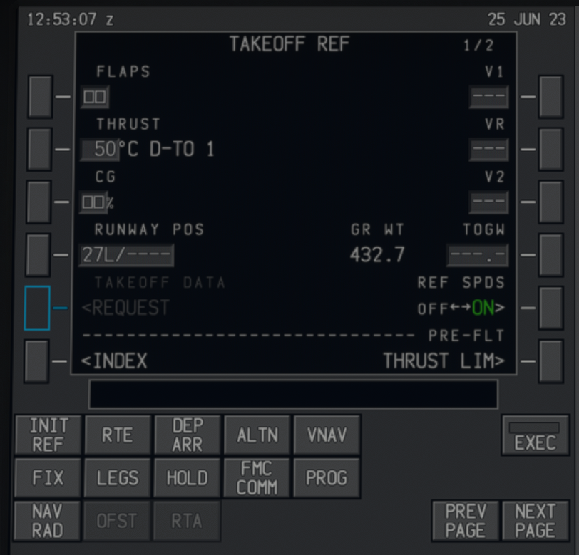

Enter
- FLAPS - 10
- CG - 20

Go to page 2

We need to enter some information. If the ATIS has been copied, we can use that or tune it in. The slope doesn't seem to have an effect yet. The COND represents the runway surface condition. We can at least enter a wet runway, it will further reduce the V1.

For information on the right column, we have
- Engine-out acceleration height
- Acceleration height
- Thrust reduction height

We can leave the engine-out acceleration height as it is. Each airline will assess their own engine-out routes in different ways, with different parameters. It could vary depending on the operator. For the 2-engine acceleration and thrust reduction, there are 2 ICAO procedures: NADP 1 and NADP 2. We set the heights as follows

NADP 1:
  - ACCEL HT - 3000ft
  - THR REDUCTION - 1500ft

NADP 2:
  - ACCEL HT - 1000ft
  - THR REDUCTION - 1000ft

Flying a NADP 2, we accelerate and retract the flaps sooner. Flying a NADP 1, we climb higher quicker. NADP 1 can be useful if there is a high minimum altitude constraint early on the SID or if departing in the wrong direction on radar vector SID. In the USA, typically, NADP 2 will be preferred (acceleration can even be lower). In Europe, typically, NADP 1 is preferred (except in EGLL).  

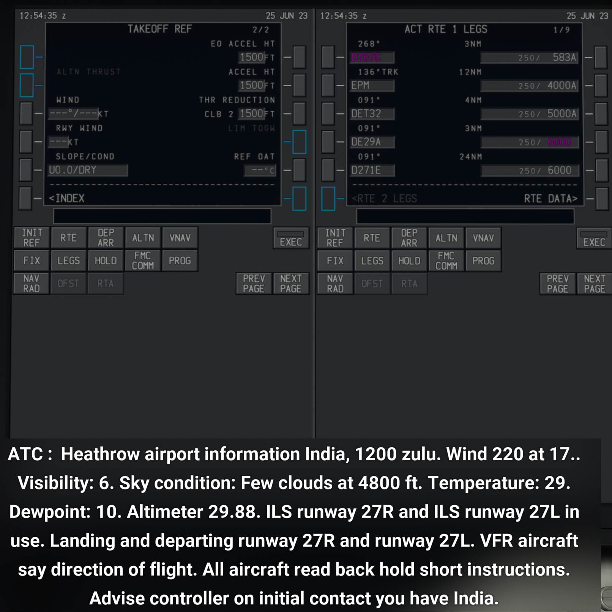

So, for our flight, we will enter:
- WIND - 220/17 (if there is a leading 0, enter it. Eg. 060/15 and not 60/15)
- SLOPE/COND - "/W" (wet runway since it's EGLL, to reduce V1. Leading slash is important)
- ACCEL HT - 1000
- THR REDUCTION - 1000
- REF OAT - 29

Click PREV PAGE to come back to TAKEOFF page 1.

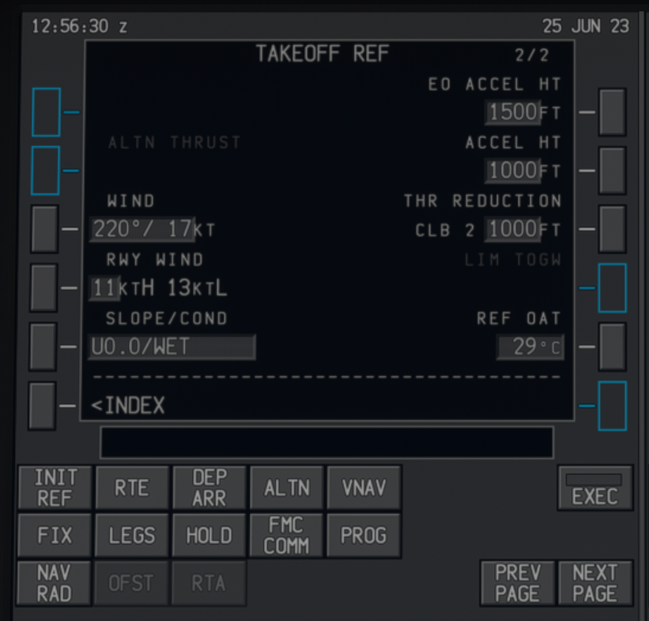

Now, we need to insert the V speeds. Just line-select once R1, R2 and R3, and all the speeds will be inserted. You should get a message in green *FMC PREFLIGHT COMPLETE*.

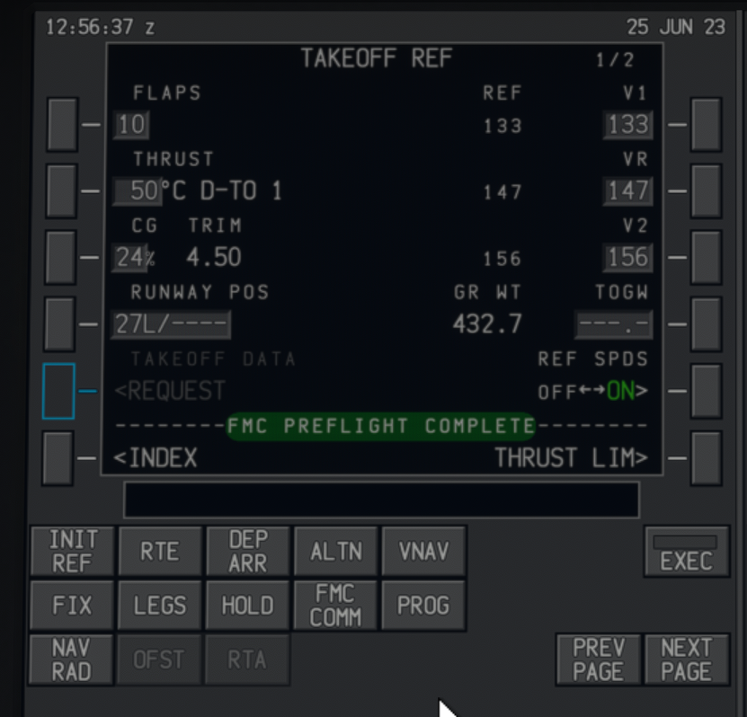

## BEFORE START checklist

// TODO

Start APU, deselect EXT PWR

 Lining up
 Lights

 ### Request higher

// TODO